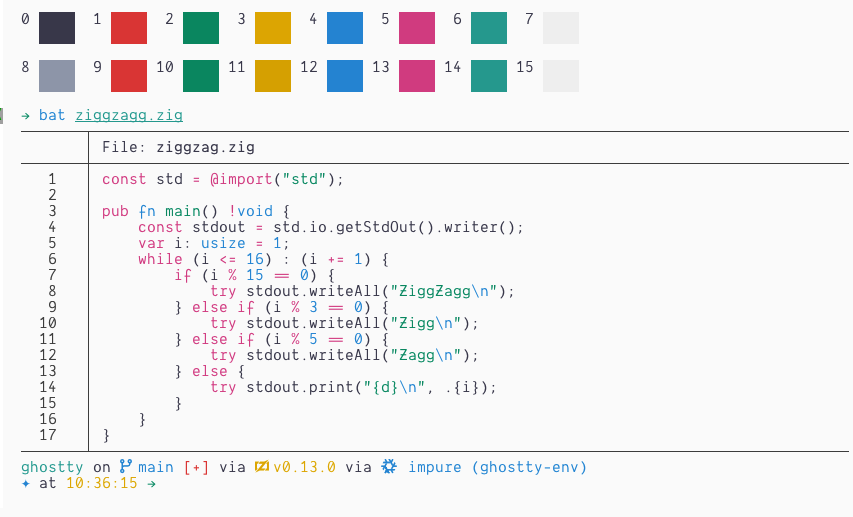

# Night Owl for Ghostty

A port of Sarah Drasner’s [Night Owl VS Code theme](https://github.com/sdras/night-owl-vscode-theme) to Ghostty.

## Installing

- Add the `NightOwlDark` and/or `NightOwlLight` config file(s) to your themes directory (`$XDG_CONFIG_HOME/ghostty/themes` or `$PREFIX/share/ghostty/themes`)
- Add one of the following to your Ghostty config:
  - `theme = NightOwlDark`
  - `theme = NightOwlLight`
  - `theme = dark:NightOwlDark,light:NightOwlLight`
